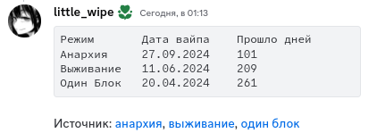

# twc-dc-wipe-bot

selfbot для оповещения о тоm сколько дней прошло с последнего вайпа

## Осторожно

Это
selfbot [со всеми вытекающими](https://support.discord.com/hc/ru/articles/115002192352-%D0%90%D0%B2%D1%82%D0%BE%D0%BC%D0%B0%D1%82%D0%B8%D0%B7%D0%B8%D1%80%D0%BE%D0%B2%D0%B0%D0%BD%D0%BD%D1%8B%D0%B5-%D1%83%D1%87%D0%B5%D1%82%D0%BD%D1%8B%D0%B5-%D0%B7%D0%B0%D0%BF%D0%B8%D1%81%D0%B8-%D1%81%D1%8D%D0%BB%D1%84-%D0%B1%D0%BE%D1%82%D1%8B)

## Usage

1. Копируем `config.example.js` в `config.js`
2. Указываем token
   аккаунта ([Инструкция](https://github.com/aiko-chan-ai/discord.js-selfbot-v13?tab=readme-ov-file#get-token-))
3. Указываем id каналов, в которых бот будет отвечать
4. `npm start`
